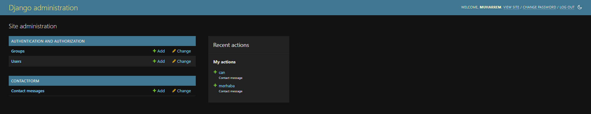
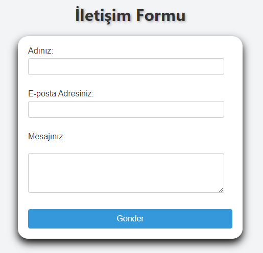

# İletişim Formu Uygulaması
Bu proje, Django web framework'ü kullanılarak oluşturulan bir iletişim formu uygulamasıdır. Kullanıcılar bu form aracılığıyla adlarını, e-posta adreslerini ve iletmek istedikleri mesajları gönderebilirler. Gönderilen iletişim mesajları admin panelinde yönetilebilir.

## Kullanılan Teknolojiler
- Django: Python tabanlı bir web framework'ü.
- HTML: Web sayfalarını oluşturmak için kullanılan işaretleme dili.
- CSS: Web sayfalarını biçimlendirmek ve düzenlemek için kullanılan stil dili.
- JavaScript: Web sayfalarını etkileşimli hale getirmek için kullanılan bir programlama dili.
- AJAX: Asenkron veri alışverişi yapmak için kullanılan bir web geliştirme teknolojisi.

## Özellikler
Kullanıcılar adlarını, e-posta adreslerini ve iletmek istedikleri mesajları iletebilirler.
İletişim formu AJAX kullanılarak sunucuya gönderilir ve sayfa yeniden yüklenmeden işlenir.
Gönderilen iletişim mesajları admin panelinde yönetilebilir.
Kullanıcılar gönderdikleri mesajın başarıyla iletilip iletilmediğini bir modal aracılığıyla görürler.

## Kurulum
Projeyi klonlayın:
 ```bash
git clone https://github.com/muharremosmantopakkaya/Django_ContactForm.git
```
Proje dizinine gidin:
 ```bash
cd django1
```
Gerekli paketleri yükleyin:
 ```bash
pip install Django
```
Sunucuyu başlatın:
 ```bash
python manage.py runserver
```
## Uygulama Arayüzleri

### Admin Paneli



Admin paneli, iletişim formu aracılığıyla gönderilen mesajları yönetmek için kullanılan bir arayüzdür. Buradan gönderilen mesajları görüntüleyebilir, düzenleyebilir ve silebilirsiniz.

### İletişim Formu



İletişim formu, kullanıcıların adlarını, e-posta adreslerini ve iletmek istedikleri mesajları göndermelerini sağlar. Kullanıcılar bu form aracılığıyla ilettikleri mesajların durumunu bir modal aracılığıyla görüntüleyebilirler.
